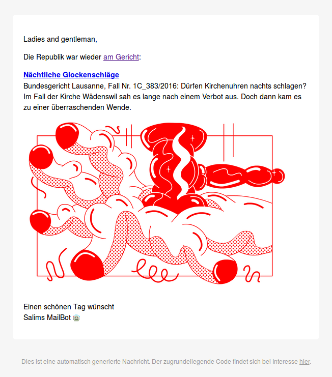

# Republik Mailer

Send e-mails spreading recent articles from a certain format of the online newspaper [Republik](https://www.republik.ch/).

## Requirements

First of all: This script doesn't allow any unauthenticated access to the online newspaper. You have to be a (paying) [subscriber of Republik](https://www.republik.ch/angebote). This allows you to [log in to the site](https://www.republik.ch/anmelden) in order to have a session cookie created needed for authentication. This cookie is named `connect.sid` and you need to provide its value (a cryptographic hash) as the `auth_cookie` argument[^reveal] to the function `get_latest_articles()`. Instead of having to provide an `auth_cookie` argument, the cookie's value can also be stored in [`config.toml`](#config) or even a text file named `.auth_cookie` in the same folder as this script.

In addition, the `from` sender address as well as the `to` receiver address and the salutation for the e-mails being sent should be set in the [`config.toml` file](#config), which must be located in the working directory.


[^reveal]: How you access the locally stored cookies of a specific site in Google Chrome is described [here](https://developers.google.com/web/tools/chrome-devtools/storage/cookies), the same for Firefox [here](https://developer.mozilla.org/docs/Tools/Storage_Inspector).


## Setup

### Install R packages

To install the necessary R packages, run the following:

```r
install.packages(pkgs = c("glue",
                          "hms",
                          "keyring",
                          "knitr",
                          "lubridate",
                          "magrittr",
                          "RcppTOML",
                          "remotes",
                          "rvest",
                          "tidyverse"))
                          
remotes::install_github("rich-iannone/blastula")
```

### Config

To create the necessary [TOML](https://github.com/toml-lang/toml#readme) config file, customize and run the following:

```r
readr::write_lines(path = "config.toml",
                   x = c("from = 'email@address.domain'",
                         "to = 'email@address.domain'",
                         "salutation = 'Ladies and gentleman'",
                         "auth_cookie = 's%...'"))

blastula::create_email_creds_file(user = "******@address.suffix",
                                  password = "******",
                                  host = "smtp.address.suffix",
                                  port = 587L,
                                  sender = "Your Name (\U1F916)",
                                  use_ssl = FALSE,
                                  use_tls = TRUE,
                                  authenticate = TRUE,
                                  creds_file_name = ".mail_credentials")
```

## Run the script

It's recommended that you adapt the script to your needs before you run it. For example, change the `format` to any of the existing Republik formats including:

- `7-uhr-newsletter`
- `am-gericht`
- `am-wegesrand`
- `an-die-verlagsetage`
- `alles-was-recht-ist`
- `auf-lange-sicht`
- `aus-der-arena`
- `aus-der-redaktion`
- `bergs-nerds`
- `binswanger`
- `briefing-aus-bern`
- `buchclub`
- `ctrl-alt-r`
- `das-leben-spielt`
- `eidgenoessische-randnotizen`
- `film`
- `fotobuch`
- `gedankensplitter`
- `helfen-sie-mit`
- `herd-und-hof`
- `klang`
- `nahr`
- `poesie-prosa`
- `preis-der-republik`
- `raumdeutung`
- `sehfeld`
- `theater`
- `theorie-praxis`
- `was-diese-woche-wichtig-war`
- `was-kommt`
- `welt-in-serie`
- `wochenend-newsletter`

Then to run it from a shell:

```sh
Rscript --vanilla \
         -e "source(file = knitr::purl(input = 'republik_mailer.Rmd', \
                                       output = tempfile(), \
                                       quiet = TRUE), \
                    encoding = 'UTF-8', \
                    echo = FALSE) ; \
             update_article_metadata() ; \
             mail_am_gericht() ; \
             mail_briefing_aus_bern()"
```

## E-mail example

An e-mail for a new post in the Republik format [_Am Gericht_](https://www.republik.ch/format/am-gericht) could look like this:


